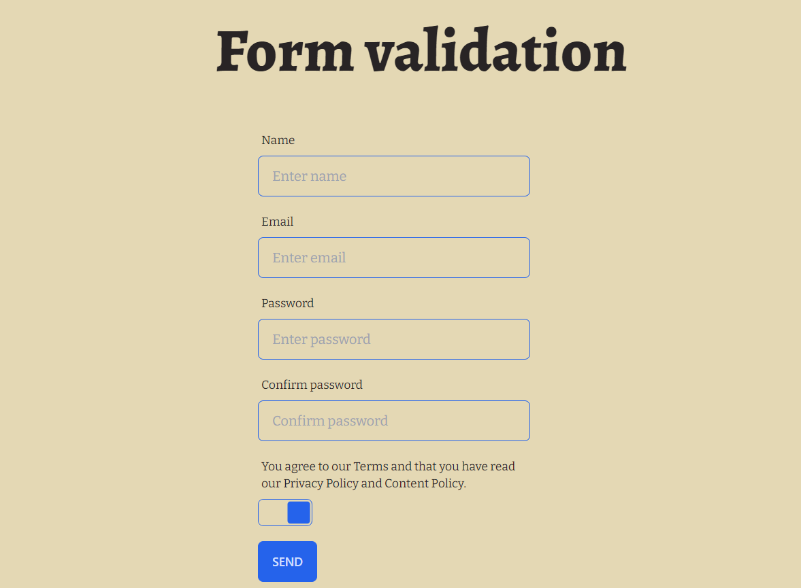

<div align="center">
<h1 align="center">Form validation</h1></div>



## Table of contents

* [General info](#general-info)
* [Demo](#demo)
* [Getting Started](#getting-started)
* [How to Use](#how-to-use)
* [Contact](#contact)

## General info

Form validation is an application written in JavaScript using TailWindCSS and daisyUI components for styling. This application can be used to validate form data and submitting it to the specific URL address.

## Demo

Check app demo [here.](https://formvalidators.netlify.app/)

## Getting Started

To run the project, follow these steps:

1. Move to directory `Form_validation`

```bash
cd Form_validation
```

2. Install the required dependencies using the command

```bash
npm install
```

3. Generate the Tailwind CSS file using the command

```bash
npm run build:tailwind
```

4. Open the `index.html` file in a web browser.

## How to Use

After running g the application, you fill in all the fields of the form, then press the `SUBMIT` button and if the fields are filled in correctly, the data is sent to the specified URL

## Technologies

This project was written using the following technologies:

* JavaScript
* HTML
* CSS (with Tailwind CSS 3.2.X)
* DaisyUI 2.X

## Contact

Created by [@Gamattowicz](https://github.com/Gamattowicz) - feel free to contact me!
